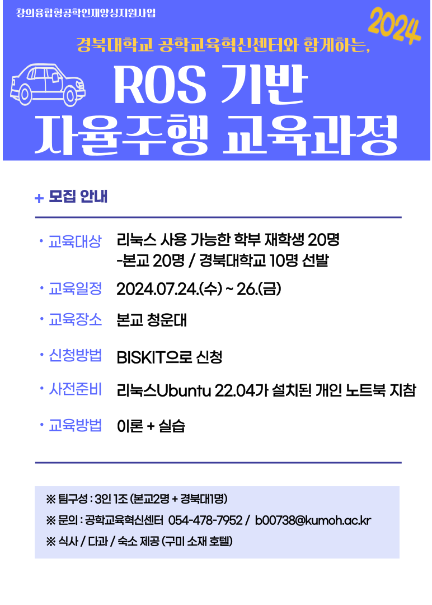

# 금오공대 2024 ROS 워크숍

1. 준비물
2. 목차
## 1. 준비물
* Ubuntu 22.04 설치된 노트북
  * 원활한 강의 진행을 위해서 반드시 Ubuntu 22.04를 설치
  * 가상머신이나 VMWare를 통한 Ubuntu 22.04 설치 금지!!

* ROS 2 humble 버전 설치
  * 설치방법 : [링크 참조](https://docs.ros.org/en/humble/Installation/Ubuntu-Install-Debians.html)

* JaraBot

## 2. 목차
1. 1일차
2. 2일차
3. 3일차

## 시간표
### Day 1

| 시간   |      내용      |
|----------|:-------------:|
| 09:30 ~ 10:00 | [인사, 목표, Q&A](https://docs.google.com/presentation/d/1-fi3zFYycrmC-Ef20UTDN0_DRWQdzVikaOA5hjFivsw/edit#slide=id.p)  - 신 |
| 10:00 ~ 11:00 | [ROS 2 Trend](https://github.com/jarabot/kumoh2024/blob/main/ROS2/README.md#ros-trend) (ROSCon)  - 신|
| 11:00 ~ 12:00 | [개발 환경 설정 및 확인](./ROS2/README.md) - 신 |
| 12:00 ~ 13:00 | 점심식사 |
| 13:00 ~ 14:00 | [CLI 도구 사용법 및 핵심 개념 Quick 리뷰](./ROS2/1_Beginner:CLITools/README.md) - 신 |
| 14:00 ~ 15:00 | [pub/sub 구현 C++](./ROS2/2_Beginner:ClientLibrary/4\)writingPublisherSubscriber.md), [pub/sub 구현 Python](./ROS2/2_Beginner:ClientLibrary/5\)writingPublisherSubscriberPython.md) - 신 |
| 15:00 ~ 16:00 | [service 구현 C++](./ROS2/2_Beginner:ClientLibrary/6\)writingServiceServerClient.md), [service 구현 Python](./ROS2/2_Beginner:ClientLibrary/7\)writingActionServerClientPython.md)  - 문 |
| 16:00 ~ 17:00 | [커스텀 msg와 srv 파일 생성하기](./ROS2/2_Beginner:ClientLibrary/8\)CreatingCustomMsgAndSrvFiles.md), [custom interface 구현하기](./ROS2/2_Beginner:ClientLibrary/9\)implementingCustomInterfaces.md)  -문 |
| 17:00 ~ 18:00 | [action server/client 작성 (C++)](ROS2/2_Beginner:ClientLibrary/14\)writingActionServerClient.md), [action server/client 작성 (Python)](./ROS2/2_Beginner:ClientLibrary/7\)writingActionServerClientPython.md)  - 문 |
| 18:00 ~ 19:00 | 저녁식사  |
| 19:00 ~ 20:00 | [tf2 소개](./ROS2/5_Intermediate:TF2/tf2_IntroducingTF2.md), [static broadcaster 작성하기(C++)](./ROS2/5_Intermediate:TF2/tf2_WritingAStaticBroadcaster_C++.md), [static broadcaster 작성하기(Python)](./ROS2/5_Intermediate:TF2/tf2_WritingAStaticBroadcaster_Python.md), [broadcaster 작성하기(C++)](./ROS2/5_Intermediate:TF2/tf2_WritingABroadcaster_C++.md), [broadcaster 작성하기(Python)](./ROS2/5_Intermediate:TF2/tf2_WritingABroadcaster_Python.md) - 문 |
| 20:00 ~ 21:00 | [listener 작성하기(C++)](./ROS2/5_Intermediate:TF2/tf2_WritingAListener_C++.md), [listener 작성하기(Python)](./ROS2/5_Intermediate:TF2/tf2_WritingAListener_Python.md) - 문 | 
| 21:00 ~ 21:30 | [parameters 사용하기 (C++)](./ROS2/2_Beginner:ClientLibrary/10\)UsingParametersInClassCpp.md), [parameters 사용하기 (Python)](./ROS2/2_Beginner:ClientLibrary/11\)usingParameterPython.md) - 문 |

* [개발 환경 설정 확인](./ROS2/1_Beginner:CLITools/1_Configuring%20environment.md) - 신
* [CLI 도구 사용법 Quick 리뷰](./ROS2/1_Beginner:CLITools/8_usingRqt_console.md) - 신
* [ROS 2 핵심 개념 Quick 리뷰](./ROS2/1_Beginner:CLITools/3_nodes.md) - 신
* [pub/sub 구현 C++](./ROS2/2_Beginner:ClientLibrary/4\)writingPublisherSubscriber.md) - 신
* [pub/sub 구현 Python](./ROS2/2_Beginner:ClientLibrary/5\)writingPublisherSubscriberPython.md) - 신
* [service 구현 C++](./ROS2/2_Beginner:ClientLibrary/6\)writingServiceServerClient.md) - 문
* [service 구현 Python](./ROS2/2_Beginner:ClientLibrary/7\)writingActionServerClientPython.md) - 문
* [커스텀 msg와 srv 파일 생성하기](./ROS2/2_Beginner:ClientLibrary/8\)CreatingCustomMsgAndSrvFiles.md) - 문
* [custom interface 구현하기](./ROS2/2_Beginner:ClientLibrary/9\)implementingCustomInterfaces.md) - 문
* [parameters 사용하기 (C++)](./ROS2/2_Beginner:ClientLibrary/10\)UsingParametersInClassCpp.md) - 문
* [parameters 사용하기 (Python)](./ROS2/2_Beginner:ClientLibrary/11\)usingParameterPython.md) - 문
* [plugins 생성하고 사용하기 (C++)](./ROS2/2_Beginner:ClientLibrary/13\)CreatingAndUsingPluginsCpp.md) - 문
* [action server/client 작성 (C++)](./ROS2/2_Beginner:ClientLibrary/6\)writingActionServerClient.md) - 문
* [action server/client 작성 (Python)](./ROS2/2_Beginner:ClientLibrary/7\)writingActionServerClientPython.md)
---
* [tf2 소개](./ROS2/5_Intermediate:TF2/tf2_IntroducingTF2.md) - 문
* [static broadcaster 작성하기(C++)](./ROS2/5_Intermediate:TF2/tf2_WritingAStaticBroadcaster_C++.md)
* [static broadcaster 작성하기(Python)](./ROS2/5_Intermediate:TF2/tf2_WritingAStaticBroadcaster_Python.md)
* [broadcaster 작성하기(C++)](./ROS2/5_Intermediate:TF2/tf2_WritingABroadcaster_C++.md)
* [broadcaster 작성하기(Python)](./ROS2/5_Intermediate:TF2/tf2_WritingABroadcaster_Python.md)
* [listener 작성하기(C++)](./ROS2/5_Intermediate:TF2/tf2_WritingAListener_C++.md)
* [listener 작성하기(Python)](./ROS2/5_Intermediate:TF2/tf2_WritingAListener_Python.md)
* [프레임 추가하기(C++)](./ROS2/5_Intermediate:TF2/tf2_AddingAFrame_C++.md)
* [프레임 추가하기(Python)](./ROS2/5_Intermediate:TF2/tf2_AddingAFrame_Python.md)
* ['time'기능 사용하기(C++)](./ROS2/5_Intermediate:TF2/tf2_UsingTime_C++.md)
* ['time'기능 사용하기(Python)](./ROS2/5_Intermediate:TF2/tf2_UsingTime_Python.md)
* [시간여행 하기(C++)](./ROS2/5_Intermediate:TF2/tf2_TravelingInTime_C++.md)
* [시간여행 하기(Python)](./ROS2/5_Intermediate:TF2/tf2_TravelingInTime_Python.md)
* [디버깅](./ROS2/5_Intermediate:TF2/tf2_Debugging.md)
* [쿼터니언 기초](./ROS2/5_Intermediate:TF2/tf2_QuaternionFundamentals.md)
* [메세지 필터를 이용한 'stamped' 자료형 사용하기](./ROS2/5_Intermediate:TF2/tf2_UsingStampedDatatypesWith_tf2_ros_MessageFilter.md)

### Day 2
* 다룰 내용
   * JaraBot 소개
      * 관련 Robot : TurtleBot 시리즈
   * JaraBot 설정
   * 기술 소개
      * Navigation
      * Map

| 시간   |      내용      |
|----------|:-------------:|
| 09:00 ~ 10:00 | [Cartographer 이해](./Cartographer/README.md) - 신 |
| 10:00 ~ 11:00 | [Navigation 이해](./Navigation/README.md) - 신 |
| 11:00 ~ 12:00 | [시뮬레이션 SLAM](./SLAM/simulation_slam.md), [시뮬레이션 Navigation](./SLAM/simulation_nav.md) |
| 12:00 ~ 13:00 | 점심식사 |
| 13:00 ~ 14:00 | [Jarabot 소개 및 구성](./jarabot/jarabot_intro.md) [Jarabot 설정](./jarabot/Setup.md)  - 문 |
| 14:00 ~ 15:00 | [PC 설정](./jarabot/PCSetup.md), [설정완료 확인](./jarabot/Done.md) - 문|
| 15:00 ~ 16:00 | [Jarabot_Code_설명](./jarabot/jarabot_sw_intro.md), [Jarabot Source Repo](https://github.com/jarabot/jarabot), [Jarabot 휠 동작](./jarabot/wheelcontrol.md) - 문 |
| 16:00 ~ 17:00 | [Jarabot 키보드로 조작](./Exercise/MovingJarabot.md),  [JaraBot 지도 생성하기](./Exercise/BuildMap.md) - 문 |
| 17:00 ~ 18:00 | [Jarabot Navigation 하기](./Exercise/DoNavigation.md) - 문 |
| 18:00 ~ 19:00 | 저녁식사  |
| 19:00 ~ 20:00 | [Jarabot Navigation 하기](./Exercise/DoNavigation.md) - 문|
| 20:00 ~ 21:00 | 대회 준비 연습 - 신 |

### Day 3

| 시간   |      내용      |
|----------|:-------------:|
| 09:00 ~ 10:00 | 대회 소개 및 점검 - 신 |
| 10:00 ~ 11:00 | [달려! 달려! JaraBot](./Competition/GoGoJarabot.md) |
| 11:00 ~ 12:00 | 팀별 점검 |
| 12:00 ~ 13:00 | 점심식사 |
| 13:00 ~ 14:00 | [잘도 피해가는 JaraBot](./Competition/AvoidanceJarabot.md) |
| 14:00 ~ 15:00 | 회고, 시상 - 신 |
