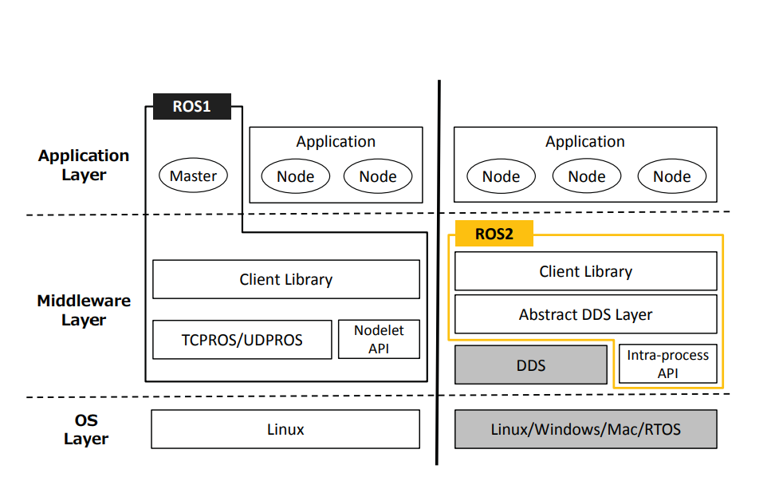
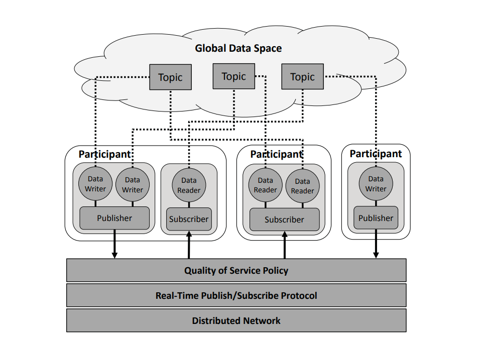

# ROS2 소개 

## ROS2란?
* “ROS is an open-source, meta-operating system for your robot.”
* ROS 2는 로봇 및 자율 주행 시스템을 개발하고 구축하는 데 사용되는 오픈 소스 로봇 운영 체제(ROS)의 두 번째 버전입니다

## ROS1과 ROS2차이 
* ROS1/ROS2 Architecture

    - ROS1 : 중앙 집중식 
    - ROS2 : DDS(Data Distribution Service)를 기반으로 한 분산 통신 
* DDS의 핵심모델 DCPS(Data-Centric Publish-Subscribe)

    - Global Data Space : 참여자들간의 데이터 교환을 위한 공간 
    - 분산 네트워크 : 여러 장치가 네트워크를 통해 상호 연결

[이미지 자료 출처](https://ieeexplore.ieee.org/document/7743223)