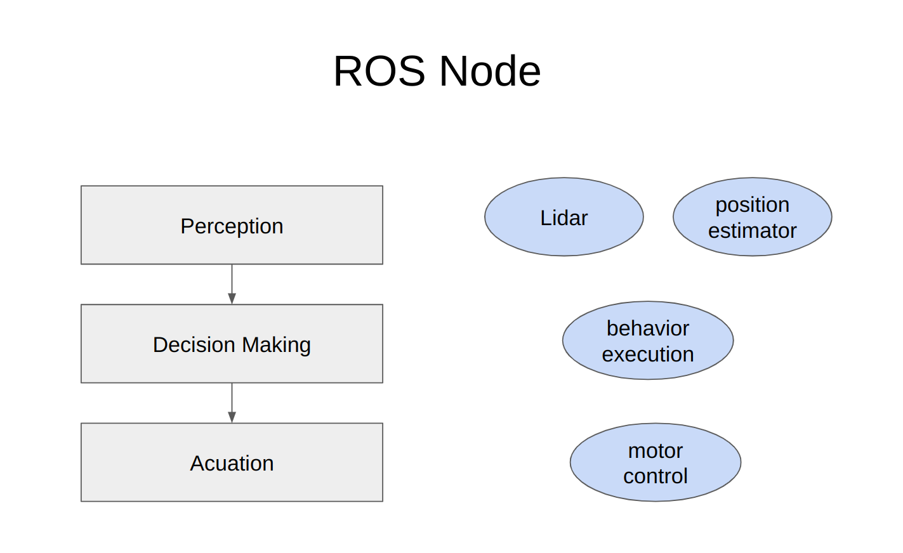

# node 이해
1. 개요
2. 실습

## 1. 개요
* ROS 2 graph란?
  * ROS 2 핵심 개념
  * ROS 2를 구성하는 요소들이 어떻게 연결되고 실행되는지 보여주는 방식


* ROS 2에서의 node란?
  * 각 node는 하나의 목적을 가지고 그 목적을 위한 일을 수행하는 책임을 진다.
    * ex) wheel motor 제어, lidar의 센서 데이터를 publish하기, ...
  
    

  * 각 node는 다른 nodes와 data를 주고 받는다. 주고 받는 방식으로는 topics, services, actions이 있다.
  

* 즉 robotics system은 이렇게 수많은 nodes로 구성되어 돌아가는 system이다.

## 2. 실습
### 2-1 ros2 run
* ros2 run 명령 형태 : package내에 있는 실행자(executable)를 실행시킨다.
```
ros2 run <package_name> <executable_name>
```

* 새 터미널을 열고 아래 명령 실행
```bash
ros2 run turtlesim turtlesim_node
```

* 결과 : turtlesim 창이 열린다.


### 2-2 ros2 node list
* 현실 실행 중인 모든 nodes 이름 확인하기
```bash
ros2 node list
```

* 결과
```
/turtlesim
```

* 새로운 터미널 열고 teleop node를 실행
```
ros2 run turtlesim turtle_teleop_key
```
  * turtlesim package 내에 있는 turtle_teleop_key 실행자를 실행하는 명령

* 다시 ros2 node list 실행
```bash
/turtlesim
/teleop_turtle
```

### 2-2-1 Remapping
* 기본 node 속성에 새로운 값을 재할당하는 옵션
  *  속성의 종류
     * node name
     * topic names
     * service names
     * ...

* /turtlesim node의 이름을 my_turtle로 재할당하는 명령 실행
```bash
ros2 run turtlesim turtlesim_node --ros-args --remap __node:=my_turtle
```

* ros2 node list 명령 다시 실행해보기
```
/turtlesim
/teleop_turtle
/my_turtle
```

### 2-3 ros node info
* node의 이름을 알고 있는 경우 해당 node의 상세 정보를 알기 위한 명령 형태
```bash
ros2 node info <node_name>
```

* my_turtle라는 이름을 가지는 node의 상세 정보를 얻기 위한 명령
```bash
ros2 node info /my_turtle
```

* 결과
```
/my_turtle
  Subscribers:
    /parameter_events: rcl_interfaces/msg/ParameterEvent
    /turtle1/cmd_vel: geometry_msgs/msg/Twist
  Publishers:
    /parameter_events: rcl_interfaces/msg/ParameterEvent
    /rosout: rcl_interfaces/msg/Log
    /turtle1/color_sensor: turtlesim/msg/Color
    /turtle1/pose: turtlesim/msg/Pose
  Services:
    /clear: std_srvs/srv/Empty
    /kill: turtlesim/srv/Kill
    /reset: std_srvs/srv/Empty
    /spawn: turtlesim/srv/Spawn
    /turtle1/set_pen: turtlesim/srv/SetPen
    /turtle1/teleport_absolute: turtlesim/srv/TeleportAbsolute
    /turtle1/teleport_relative: turtlesim/srv/TeleportRelative
    /my_turtle/describe_parameters: rcl_interfaces/srv/DescribeParameters
    /my_turtle/get_parameter_types: rcl_interfaces/srv/GetParameterTypes
    /my_turtle/get_parameters: rcl_interfaces/srv/GetParameters
    /my_turtle/list_parameters: rcl_interfaces/srv/ListParameters
    /my_turtle/set_parameters: rcl_interfaces/srv/SetParameters
    /my_turtle/set_parameters_atomically: rcl_interfaces/srv/SetParametersAtomically
  Action Servers:
    /turtle1/rotate_absolute: turtlesim/action/RotateAbsolute
  Action Clients:
```
  * ros2 node info는 subscribers, publishers, services, actions의 목록을 반환

* /teleop_turtle node에 대해서도 상세 정보 얻는 명령 실행해보기
```bash
ros2 node info /teleop_turtle
```

