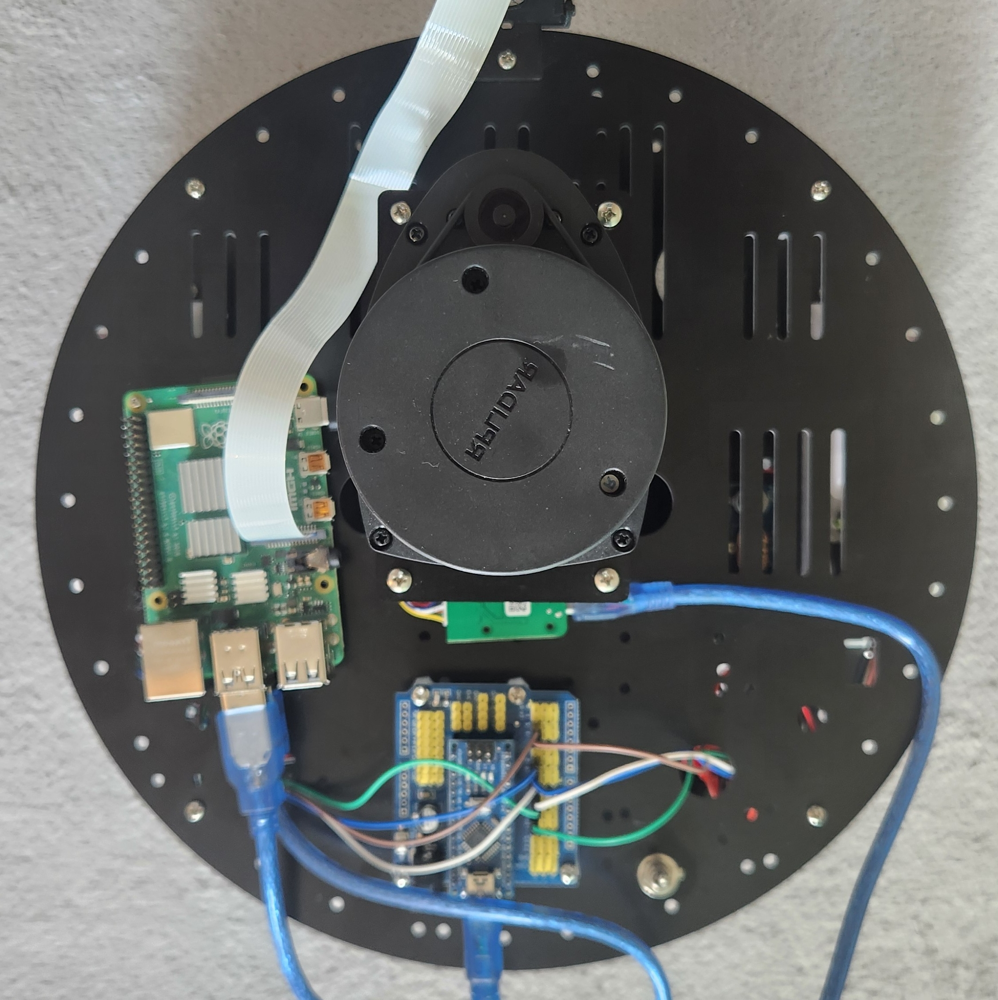
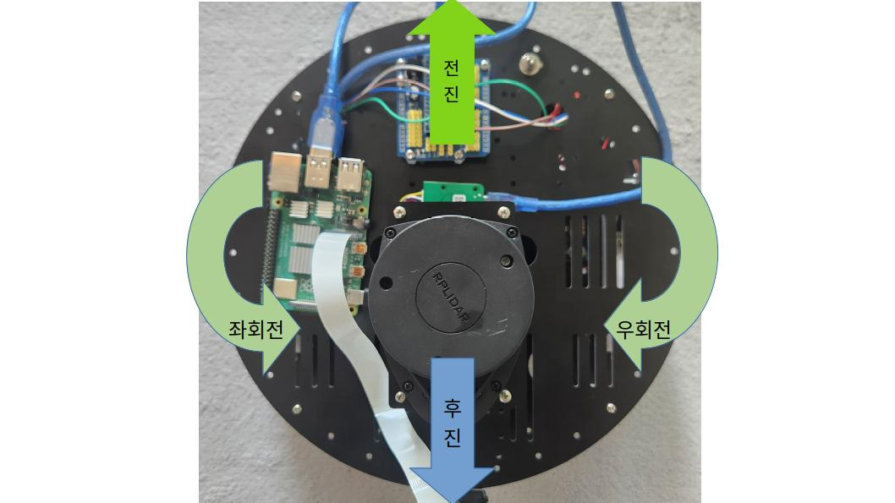
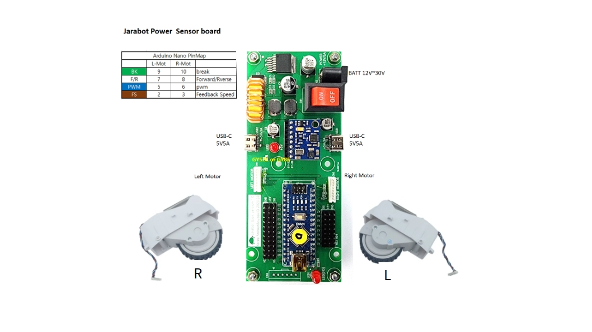

# Jarabot 소개
1. Jarabot
2. Jarabot 이동 방향
3. 모터 제어를 위한 Pin 연결
4. Jarabot 전원 공급
5. 안전 유의사항
 
# 1. Jarabot
* ROS 기반 자율주행 플랫폼
  * Jarabot 구성요소
    * Raspberry Pi 4 (ROS2 프로그램 실행)
    * Arduino Nano (모터 제어) 
    * LIDAR: 스캔 및 맵 생성
    * Left/right motors (& wheels): Jarabot 이동
    * 전원 공급 보드: battery 전원을 Raspberry Pi, left/right motor에 제공
    * camera
        
* Jarabot image (top)
  

* Jarabot image (left)
  
  
* Jarabot image (right)
  

# 2. Jarabot 이동 방향
* Jarabot 이동방향
  * 전진
  * 후진
  * 좌회전
  * 전진 + 좌회전
  * 우회전
  * 전진 + 우회전
  * 후진 + 우회전
  * 후진 + 좌회전
    
   

# 3. 모터 제어를 위한 Pin 연결
* Arduino 보드를 통해 Motor 동작을 제어한다
* Arduino - Motor cable 연결
    
  

# 4 Jarabot 전원 공급 
* 배터리팩에 연결된 전원 케이블을 전원 분배 보드의 입력 단자에 연결
  * 전원이 연결되면 LED 화면을 통해 배터리 전압이 표시된다
    * 전압이 10.5V 이하로 떨어지기 전, 반드시 어댑터를 이용하여 충전할 것
  * 라즈베리 파이는 배터리팩으로부터 전원을 공급 받음
  * 아두이노 보드와 LIDAR 센서는 라즈베리 파이에 연결된 USB 케이블을 통해 전원을 공급 받음 
  
* 충전
  * 실습 시간에 제공되는 전원 어댑터 (입력 전압 1.5V)를 이용하여 배터리팩에 연결된 충전 단자에 연결한다
  * (주의!) 전원 어댑터를 아두이노 보드의 전원 단자에 연결하면 안 됨! (사고 예방)
  * 배터리 손상 방지를 위해, 잔류 전압이 10.5V가 되기 전 충전해 줘야 한다
      
# 5. 안전 유의사항
* 배터리 연결 시, 반드시 Jarabot 본체 전원 스위치를 OFF 상태로 만들고 연결한다 
* Jarabot 이동 시 떨어뜨리거나 큰 충격이 가지 않도록 유의한다 (특히 배터리 장착 시)
* Jarabot 이동 시, 바퀴를 제외한 원판 부분을 잡고 이동한다 (부상 방지)
* 키보드 명령으로 Jarabot 이동 시, 사람 또는 장애물 (벽, 기둥, 가구 등)에 지나치게 가까이 접근하지 않도록 한다 (충돌 예방)
