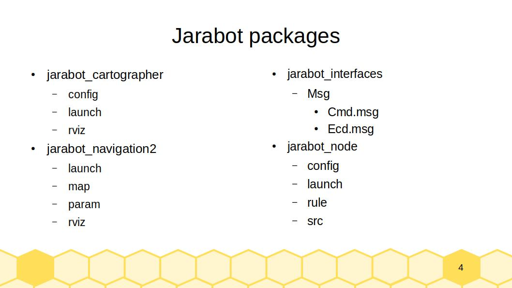

# Jarabot SW 구조 
* 1. 패키지 구조
* 2. jarabot_interfaces
* 3. jarabot_node
* 4. jarabot_cartographer
* 5. jarabot_navigation2
* [자료](https://1drv.ms/p/s!Aigic13_w6ElgpMxnw1-8k1wuFNOgQ?e=OfWzIT)

## 1. 패키지 구조

* Jarabot package 구조
  * jarabot_interfaces: Node 간 통신 인터페이스 파일 포함
  * jarabot_node: ROS Nodes 포함
    * jara_controller: Jarabot 이동 (또는 회전) 속도 조절 
    * jara_driver: Jarabot 속도 조절을 위한 모터 제어 및 바퀴 회전량 측정
    * jara_odometry: 좌우 바퀴 회전량으로부터 Jarabot Pose 추정
      * Pose: 로봇의 위치와 방향을 모두 포함하는 개념
        * geometry_msgs::msg::Pose 
        ```cpp
           # A representation of pose in free space, composed of position and orientation.
           Point position
           Quaternion orientation
        ``` 
  * jarabot_cartographer: 맵 생성 프로그램 (Cartographer) 실행에 필요한 설정 파일 포함
    * config
      * jarabot_rplidar_2d.lua
    * launch
      * cartographer.launch.py
      * occupancy_grid.launch.py
    * rviz
      * jarabot_cartographer.rviz
     
  * jarabot_navigation2: 길 찾기 프로그램 (Navigation2) 실행에 필요한 설정 파일 포함
    * launch
      * bringup_launch.py
    * map
      * map.pgm
      * map.yaml
    * param
      * jarabot.yaml
    * rviz
      * jarabot_navigation2.rviz

  

## 2. jarabot_interfaces

* interface files
  * Cmd.msg - Jarabot 속도 조절 명령
  ```cpp
    int32 linear_input
    int32 angular_input
  ```

  * Ecd.msg - Motor 회전량
  ```cpp
    std_msgs/Header header
    int32 left_encoder_val
    int32 right_encoder_val
  ```
 
## 3. jarabot_node
* jara_controller: Jarabot 속도 조절 
  * main_loop 실행 주기 설정
    ```cpp
        // JaraController 생성자
        loop_rate_ = this->get_parameter("loop_rate").get_parameter_value().get<int>();

        smoother_step_ = (2000 - 1660) / (loop_rate_ * 0.5);

        // RCLCPP_INFO(this->get_logger(), "%f %f %f %f %i", linear_gain_, angular_gain_, wheel_radius_, wheel_base_, loop_rate_);

        cmd_pub_ = this->create_publisher<jarabot_interfaces::msg::Cmd>("/cmd", loop_rate_);

        mainloop_timer_ = this->create_wall_timer(std::chrono::milliseconds(1000 / loop_rate_), std::bind(&JaraController::main_loop, this));

    ```

  * 주기적으로 이동속도 제어를 위해 "/cmd" Topic 출판
    * Note: 목표 속도가 현재 속도와 다를 때만 Topic 출판 
    ```cpp
      // Jara_controller::main_loop()
      if (shouldSendCommand)
            {
                auto cmd_msg = jarabot_interfaces::msg::Cmd();
                cmd_msg.linear_input = current_linear_input_;
                cmd_msg.angular_input = current_angular_input_;
                cmd_pub_->publish(cmd_msg);
            }
    
    ```
     * Note: 현재 속도에 비해 목표 속도가 크게 변화하면 ( >= smoother_step_) 현재 속도를 점진적으로 증가/감소 
    ```cpp
      // Jara_controller::main_loop()
      if( (target_linear_input_-current_linear_input_) > smoother_step_)
                {
                    current_linear_input_ += smoother_step_;
                    shouldSendCommand = true;
                }
    ```
* jara_driver: Jarabot 모터 제어 및 모니터링
  * "/cmd" Topic data 구독 
    * 이동 속도 명령 수신
    * cmd_callback() 호출 > "/serial_write" Topic 출판

    ```cpp
        void cmd_callback(const jarabot_interfaces::msg::Cmd::SharedPtr msg)
        {
          auto serial_msg = std_msgs::msg::UInt8MultiArray();
          std::string str = std::string("pwm,") + std::to_string(msg->angular_input) + std::string(",") + std::to_string(msg->linear_input) + std::string(" \n");
  
          serial_msg.data.reserve(str.size());
          for (char c : str)
          {
              serial_msg.data.push_back(static_cast<uint8_t>(c));
          }
  
          serial_pub_->publish(serial_msg);
        }
    ``` 
  
  * "/serial_read" Topic 구독
    * "/ecd" Topic 출판 
    ```cpp
        // JaraDriver::serial_callback()
        // Get the left and right parts of the line
            std::string left_data = line.substr(0, comma_pos);
            std::string right_data = line.substr(comma_pos + 1);
            // ROS_INFO_STREAM("comma_pos : " << comma_pos);
            // ROS_INFO_STREAM("left_data : " << left_data);
            // Convert left_data and right_data to integers
            try
            {
                auto ecd_msg = jarabot_interfaces::msg::Ecd();
                ecd_msg.header.stamp = this->get_clock()->now();
                ecd_msg.left_encoder_val = std::stoi(left_data);
                ecd_msg.right_encoder_val = std::stoi(right_data);
                ecd_pub_->publish(ecd_msg);
            }
    ``` 
    
* jara_odometry: Jarabot 위치&자세 추정
  * "/ecd" Topic 구독
    * odometry: ‘주행기록계’라는 의미
      * 로봇의 주행 정보로부터 위치/방향 계산
        
    * nav_msgs::msg::Odometry
      ```cpp       
       std_msgs/Header header
       int32 left_encoder_val
       int32 right_encoder_val
      ```

    * /ect Topic 데이터 수신 > 로봇의 현재 위치와 속도(linear/angular) 업데이트
      ```cpp
        // JaraOdometry::ecd_callback()
        // update position
        x_ += delta_distance * cos(theta_);
        y_ += delta_distance * sin(theta_);
        theta_ += delta_theta;

        // update velocity
        v_x_ = delta_distance / (ecd_time - last_time_).seconds();
        v_theta_ = delta_theta / (ecd_time - last_time_).seconds();

      ```

  * "/odom" Topic 출판
      ```cpp
        // JaraOdometry::ecd_callback()
        // next, we'll publish the odometry message over ROS
        nav_msgs::msg::Odometry odom;
        odom.header.stamp = current_time;
        odom.header.frame_id = "odom";

        // set the position
        odom.pose.pose.position.x = x_;
        odom.pose.pose.position.y = y_;
        odom.pose.pose.position.z = 0.0;
        odom.pose.pose.orientation = odom_quat;

        // set the velocity
        odom.child_frame_id = "base_link";
        odom.twist.twist.linear.x = v_x_;
        odom.twist.twist.linear.y = 0.0;
        odom.twist.twist.angular.z = v_theta_;

        // publish the message
        odom_pub_->publish(odom);

      ```
  
  * "/tf" Topic 출판
    * tf2_msgs::msg::TFMessage
      ```cpp
         odom_trans.header.stamp = current_time;
         odom_trans.header.frame_id = "odom";
         odom_trans.child_frame_id = "base_link";
 
         odom_trans.transform.translation.x = x_;
         odom_trans.transform.translation.y = y_;
         odom_trans.transform.translation.z = 0.0;
         odom_trans.transform.rotation = odom_quat;

        // send the transform
        odom_broadcaster_->sendTransform(odom_trans);
      ``` 
    * geometry_msgs::TransformStamped
      ```cpp
         # The frame id in the header is used as the reference frame of this transform.
         std_msgs/Header header

         # The frame id of the child frame to which this transform points.
         string child_frame_id
      
         # Translation and rotation in 3-dimensions of child_frame_id from header.frame_id.
         Transform transform
      ```
## 4. jara_cartographer

* config
  * jarabot_rplidar_2d.lua
    * map_builder: 맵 생성에 사용될 모듈
      *  MAP_BUILDER: 2d 맵 생성을 위한 모듈
    * trajectory_builder: 로봇 위치 추적에 사용될 프레임
      *  TRAJECTORY_BUILDER: 2d 맵 생성에 필요한 로봇 위치 추적 모듈
    * map_frame: submap 출판을 위한 프레임 ID 
    * tracking_frame: 위치 추적 대상 프레임
      * base_link: 로봇 기본 프레임
    * use_odometry: odometry 사용 유무
    * num_laser_scans: 레이저 스캐너 갯수 
  ```cpp
  -- Copyright 2016 The Cartographer Authors
  --
  -- Licensed under the Apache License, Version 2.0 (the "License");
  -- you may not use this file except in compliance with the License.
  -- You may obtain a copy of the License at
  --
  --      http://www.apache.org/licenses/LICENSE-2.0
  --
  -- Unless required by applicable law or agreed to in writing, software
  -- distributed under the License is distributed on an "AS IS" BASIS,
  -- WITHOUT WARRANTIES OR CONDITIONS OF ANY KIND, either express or implied.
  -- See the License for the specific language governing permissions and
  -- limitations under the License.

  -- /* Author: Darby Lim */
  include "map_builder.lua"
  include "trajectory_builder.lua"

  options = {
    map_builder = MAP_BUILDER,
    trajectory_builder = TRAJECTORY_BUILDER,
    map_frame = "map",
    tracking_frame = "base_link",
    published_frame = "odom",
    odom_frame = "odom",
    provide_odom_frame = false,
    publish_frame_projected_to_2d = true,
    use_odometry = true,
    use_nav_sat = false,
    use_landmarks = false,
    num_laser_scans = 1,
    num_multi_echo_laser_scans = 0,
    num_subdivisions_per_laser_scan = 1,
    num_point_clouds = 0,
    lookup_transform_timeout_sec = 0.2,
    submap_publish_period_sec = 0.3,
    pose_publish_period_sec = 5e-3,
    trajectory_publish_period_sec = 30e-3,
    rangefinder_sampling_ratio = 1.,
    odometry_sampling_ratio = 1.,
    fixed_frame_pose_sampling_ratio = 1.,
    imu_sampling_ratio = 1.,
    landmarks_sampling_ratio = 1.,
    }

    MAP_BUILDER.use_trajectory_builder_2d = true

    TRAJECTORY_BUILDER_2D.min_range = 0.12
    TRAJECTORY_BUILDER_2D.max_range = 3.5
    TRAJECTORY_BUILDER_2D.missing_data_ray_length = 3.
    TRAJECTORY_BUILDER_2D.use_imu_data = false
    TRAJECTORY_BUILDER_2D.use_online_correlative_scan_matching = true 
    TRAJECTORY_BUILDER_2D.motion_filter.max_angle_radians = math.rad(0.1)
    
    POSE_GRAPH.constraint_builder.min_score = 0.65
    POSE_GRAPH.constraint_builder.global_localization_min_score = 0.7
    
    -- POSE_GRAPH.optimize_every_n_nodes = 0
    
    return options  
  ```    
* launch
   * launch file 구조
      ```python
      def generate_launch_description():
        xxx = LaunchConfiguration(yyy)
        return LaunchDescription([
          DeclareLaunchArgument(aaa),
          Node(bbb),
          Node(ccc),
          IncludeLaunchDescription(ddd)
        ]      
      ```     
  * cartographer.launch.py
 
  ```python
  
     import os
     from ament_index_python.packages import get_package_share_directory
     from launch import LaunchDescription
     from launch.actions import DeclareLaunchArgument
     from launch_ros.actions import Node
     from launch.substitutions import LaunchConfiguration
     from launch.actions import IncludeLaunchDescription
     from launch.launch_description_sources import PythonLaunchDescriptionSource
     from launch.substitutions import ThisLaunchFileDir


     def generate_launch_description():
         use_sim_time = LaunchConfiguration('use_sim_time', default='false')
         jarabot_cartographer_prefix = get_package_share_directory('jarabot_cartographer')
         cartographer_config_dir = LaunchConfiguration('cartographer_config_dir', default=os.path.join(
                                                       jarabot_cartographer_prefix, 'config'))
         configuration_basename = LaunchConfiguration('configuration_basename',
                                                      default='jarabot_rplidar_2d.lua')
     
         resolution = LaunchConfiguration('resolution', default='0.05')
         publish_period_sec = LaunchConfiguration('publish_period_sec', default='1.0')
     
         rviz_config_dir = os.path.join(get_package_share_directory('jarabot_cartographer'),
                                        'rviz', 'jarabot_cartographer.rviz')

         return LaunchDescription([
             DeclareLaunchArgument(
                 'cartographer_config_dir',
                 default_value=cartographer_config_dir,
                 description='config 파일의 전체 경로'),
             DeclareLaunchArgument(
                 'configuration_basename',
                 default_value=configuration_basename,
                 description='cartographer 설정에 사용하는 lua 파일 이름'),
             DeclareLaunchArgument(
                 'use_sim_time',
                 default_value='false',
                 description='simulation(Gazebo) clock 사용여부'),
     
             Node(
                 package='cartographer_ros',
                 executable='cartographer_node',
                 name='cartographer_node',
                 output='screen',
                 parameters=[{'use_sim_time': use_sim_time}],
                 arguments=['-configuration_directory', cartographer_config_dir,
                            '-configuration_basename', configuration_basename]),
     
             DeclareLaunchArgument(
                 'resolution',
                 default_value=resolution,
                 description='occupancy grid의 각 cell의 resolution'),
     
             DeclareLaunchArgument(
                 'publish_period_sec',
                 default_value=publish_period_sec,
                 description='OccupancyGrid publishing period'),
     
             IncludeLaunchDescription(
                 PythonLaunchDescriptionSource([ThisLaunchFileDir(), '/occupancy_grid.launch.py']),
                 launch_arguments={'use_sim_time': use_sim_time, 'resolution': resolution,
                                   'publish_period_sec': publish_period_sec}.items(),
             ),
     
             # Node(
             #     package='rviz2',
             #     executable='rviz2',
             #     name='rviz2',
             #     arguments=['-d', rviz_config_dir],
             #     parameters=[{'use_sim_time': use_sim_time}],
             #     output='screen'),
         ]) 
  ```

  * occupancy_grid.launch.py
 
  ```python
  from launch import LaunchDescription
  from launch.actions import DeclareLaunchArgument
  from launch_ros.actions import Node
  from launch.substitutions import LaunchConfiguration
  
  def generate_launch_description():
      use_sim_time = LaunchConfiguration('use_sim_time', default='false')
      resolution = LaunchConfiguration('resolution', default='0.05')
      publish_period_sec = LaunchConfiguration('publish_period_sec', default='1.0')
  
      return LaunchDescription([
          DeclareLaunchArgument(
              'resolution',
              default_value=resolution,
              description='occupancy grid의 각 cell의 resolution'),
  
          DeclareLaunchArgument(
              'publish_period_sec',
              default_value=publish_period_sec,
              description='OccupancyGrid publish 주기'),
  
          DeclareLaunchArgument(
              'use_sim_time',
              default_value='false',
              description='simulation(Gazebo) clock 사용 여부'),
  
          Node(
              package='cartographer_ros',
              executable='cartographer_occupancy_grid_node',
              name='cartographer_occupancy_grid_node',
              output='screen',
              parameters=[{'use_sim_time': use_sim_time}],
              arguments=['-resolution', resolution, '-publish_period_sec', publish_period_sec]),
      ])
  
  ```       
  * rviz
    * [jarabot_cartographer.rviz](https://github.com/jarabot/jarabot/blob/7a6a3cfa6b5fe9eca421305e927ed8236417f548/jarabot_cartographer/rviz/jarabot_cartographer.rviz)
      

## 5. jara_navigation2

* launch
  * bringup_launch.py
    ```python
       # Copyright (c) 2018 Intel Corporation
       #
       # Licensed under the Apache License, Version 2.0 (the "License");
       # you may not use this file except in compliance with the License.
       # You may obtain a copy of the License at
       #
       #     http://www.apache.org/licenses/LICENSE-2.0
       #
       # Unless required by applicable law or agreed to in writing, software
       # distributed under the License is distributed on an "AS IS" BASIS,
       # WITHOUT WARRANTIES OR CONDITIONS OF ANY KIND, either express or implied.
       # See the License for the specific language governing permissions and
       # limitations under the License.

       import os
       
       from ament_index_python.packages import get_package_share_directory
       
       from launch import LaunchDescription
       from launch.actions import (DeclareLaunchArgument, GroupAction,
                                   IncludeLaunchDescription, SetEnvironmentVariable)
       from launch.conditions import IfCondition
       from launch.launch_description_sources import PythonLaunchDescriptionSource
       from launch.substitutions import LaunchConfiguration, PythonExpression
       from launch_ros.actions import Node
       from launch_ros.actions import PushRosNamespace
       from nav2_common.launch import RewrittenYaml
       
       
       def generate_launch_description():
           # Get the launch directory
           bringup_dir = get_package_share_directory('nav2_bringup')
           launch_dir = os.path.join(bringup_dir, 'launch')
       
           # Create the launch configuration variables
           namespace = LaunchConfiguration('namespace')
           use_namespace = LaunchConfiguration('use_namespace')
           slam = LaunchConfiguration('slam')
           map_yaml_file = LaunchConfiguration('map')
           use_sim_time = LaunchConfiguration('use_sim_time')
           params_file = LaunchConfiguration('params_file')
           autostart = LaunchConfiguration('autostart')
           use_composition = LaunchConfiguration('use_composition')
           use_respawn = LaunchConfiguration('use_respawn')
           log_level = LaunchConfiguration('log_level')
       
           # Map fully qualified names to relative ones so the node's namespace can be prepended.
           # In case of the transforms (tf), currently, there doesn't seem to be a better alternative
           # https://github.com/ros/geometry2/issues/32
           # https://github.com/ros/robot_state_publisher/pull/30
           # TODO(orduno) Substitute with `PushNodeRemapping`
           #              https://github.com/ros2/launch_ros/issues/56
           remappings = [('/tf', 'tf'),
                         ('/tf_static', 'tf_static')]
       
           # Create our own temporary YAML files that include substitutions
           param_substitutions = {
               'use_sim_time': use_sim_time,
               'yaml_filename': map_yaml_file}
       
           configured_params = RewrittenYaml(
               source_file=params_file,
               root_key=namespace,
               param_rewrites=param_substitutions,
               convert_types=True)
       
           stdout_linebuf_envvar = SetEnvironmentVariable(
               'RCUTILS_LOGGING_BUFFERED_STREAM', '1')
       
           declare_namespace_cmd = DeclareLaunchArgument(
               'namespace',
               default_value='',
               description='Top-level namespace')
       
           declare_use_namespace_cmd = DeclareLaunchArgument(
               'use_namespace',
               default_value='false',
               description='Whether to apply a namespace to the navigation stack')
       
           declare_slam_cmd = DeclareLaunchArgument(
               'slam',
               default_value='False',
               description='Whether run a SLAM')
       
           declare_map_yaml_cmd = DeclareLaunchArgument(
               'map',
               description='Full path to map yaml file to load')
       
           declare_use_sim_time_cmd = DeclareLaunchArgument(
               'use_sim_time',
               default_value='false',
               description='Use simulation (Gazebo) clock if true')
       
           declare_params_file_cmd = DeclareLaunchArgument(
               'params_file',
               default_value=os.path.join(bringup_dir, 'params', 'nav2_params.yaml'),
               description='Full path to the ROS2 parameters file to use for all launched nodes')
       
           declare_autostart_cmd = DeclareLaunchArgument(
               'autostart', default_value='true',
               description='Automatically startup the nav2 stack')
       
           declare_use_composition_cmd = DeclareLaunchArgument(
               'use_composition', default_value='True',
               description='Whether to use composed bringup')
       
           declare_use_respawn_cmd = DeclareLaunchArgument(
               'use_respawn', default_value='False',
               description='Whether to respawn if a node crashes. Applied when composition is disabled.')
       
           declare_log_level_cmd = DeclareLaunchArgument(
               'log_level', default_value='info',
               description='log level')
       
           # Specify the actions
           bringup_cmd_group = GroupAction([
               PushRosNamespace(
                   condition=IfCondition(use_namespace),
                   namespace=namespace),
       
               Node(
                   condition=IfCondition(use_composition),
                   name='nav2_container',
                   package='rclcpp_components',
                   executable='component_container_isolated',
                   parameters=[configured_params, {'autostart': autostart}],
                   arguments=['--ros-args', '--log-level', log_level],
                   remappings=remappings,
                   output='screen'),
       
               IncludeLaunchDescription(
                   PythonLaunchDescriptionSource(os.path.join(launch_dir, 'slam_launch.py')),
                   condition=IfCondition(slam),
                   launch_arguments={'namespace': namespace,
                                     'use_sim_time': use_sim_time,
                                     'autostart': autostart,
                                     'use_respawn': use_respawn,
                                     'params_file': params_file}.items()),
       
               IncludeLaunchDescription(
                   PythonLaunchDescriptionSource(os.path.join(launch_dir,
                                                              'localization_launch.py')),
                   condition=IfCondition(PythonExpression(['not ', slam])),
                   launch_arguments={'namespace': namespace,
                                     'map': map_yaml_file,
                                     'use_sim_time': use_sim_time,
                                     'autostart': autostart,
                                     'params_file': params_file,
                                     'use_composition': use_composition,
                                     'use_respawn': use_respawn,
                                     'container_name': 'nav2_container'}.items()),
       
               IncludeLaunchDescription(
                   PythonLaunchDescriptionSource(os.path.join(launch_dir, 'navigation_launch.py')),
                   launch_arguments={'namespace': namespace,
                                     'use_sim_time': use_sim_time,
                                     'autostart': autostart,
                                     'params_file': params_file,
                                     'use_composition': use_composition,
                                     'use_respawn': use_respawn,
                                     'container_name': 'nav2_container'}.items()),
           ])
       
           # Create the launch description and populate
           ld = LaunchDescription()
       
           # Set environment variables
           ld.add_action(stdout_linebuf_envvar)
       
           # Declare the launch options
           ld.add_action(declare_namespace_cmd)
           ld.add_action(declare_use_namespace_cmd)
           ld.add_action(declare_slam_cmd)
           ld.add_action(declare_map_yaml_cmd)
           ld.add_action(declare_use_sim_time_cmd)
           ld.add_action(declare_params_file_cmd)
           ld.add_action(declare_autostart_cmd)
           ld.add_action(declare_use_composition_cmd)
           ld.add_action(declare_use_respawn_cmd)
           ld.add_action(declare_log_level_cmd)
       
           # Add the actions to launch all of the navigation nodes
           ld.add_action(bringup_cmd_group)
       
           return ld
    ```
* map
  * map.pgm
  * map.yaml
  ```yaml
  image: map.pgm
  mode: trinary
  resolution: 0.05
  origin: [-7.2, -4.42, 0]
  negate: 0
  occupied_thresh: 0.65
  free_thresh: 0.25
  ```  
* param
  * [jarabot.yaml](https://github.com/jarabot/jarabot/blob/7a6a3cfa6b5fe9eca421305e927ed8236417f548/jarabot_navigation2/param/jarabot.yaml)
      
    
  * rviz
    * jarabot_navigation2.rviz
   
    
